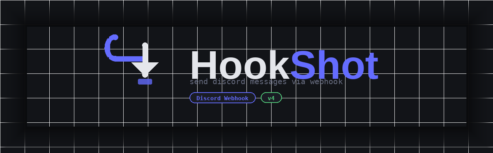

# 🪝 HookShot

Send Discord messages through any webhook — plain text, embeds, custom bot identity. No installs, no dependencies. Just open the HTML file and go.

 

[⬇ Download](https://github.com/specyfikation/Webhook-Discord-Creator/blob/main/index.html) · [View source](https://github.com/specyfikation/Webhook-Discord-Creator/blob/main/index.html) · [Report a bug](https://github.com/specyfikation/HookShot/issues)

---

## Features

- Send plain text messages to any Discord webhook in one click
- Custom bot name and avatar URL per message
- Full embed builder — title, description, title URL, sidebar color picker, footer, auto timestamp
- Character counter with warning at 1800 chars
- `[OK]` / `[ERR]` status feedback with Discord's actual error message
- Zero dependencies — single `.html` file, works offline

## Requirements

- A browser (Chrome, Firefox, Edge, anything modern)
- A Discord webhook URL — that's it

## Usage

**1. Get a webhook URL**

In Discord: channel settings → **Integrations** → **Webhooks** → **New Webhook** → copy the URL.

**2. Open `hookshot.html`**

No server needed. Open the file directly in your browser (`File → Open` or drag and drop).

**3. Fill in the fields and send**

| Field | Required | Notes |
|---|---|---|
| Webhook URL | ✅ | Paste your full Discord webhook URL |
| Bot name | ❌ | Overrides the default webhook name. Min 2 characters |
| Avatar URL | ❌ | Must start with `https://` |
| Content | ✅* | Supports Discord markdown (`**bold**`, `*italic*`, `@everyone`) |
| Embed | ❌ | Toggle the switch to expand the embed builder |

*Required if embed is disabled. If embed is enabled, content is optional.

**Embed fields:**

| Field | Limit | Notes |
|---|---|---|
| Title | 256 chars | Clickable if you fill the Title URL |
| Description | 4096 chars | Supports Discord markdown |
| Title URL | — | Makes the title a hyperlink |
| Sidebar color | — | Color picker + hex input, synced |
| Footer | 2048 chars | Plain text |

A timestamp is added automatically to every embed.

## Troubleshooting

**Error 401 — Unauthorized**

The webhook URL is wrong or was deleted. Go back to Discord and copy a fresh one.

**Error 400 — Bad Request**

Usually means the embed is empty. Make sure it has at least a title or a description.

**Request blocked**

The browser blocked the request. This can happen if the URL isn't a valid `https://discord.com/api/webhooks/...` address.

**Nothing happens when I click send**

Open the browser console (`F12 → Console`) and check for errors. Most likely a malformed URL.

## License

MIT - see [LICENSE](https://github.com/specyfikation/Webhook-Discord-Creator/blob/main/LICENSE)

Made by [specyfikation](https://github.com/specyfikation)
